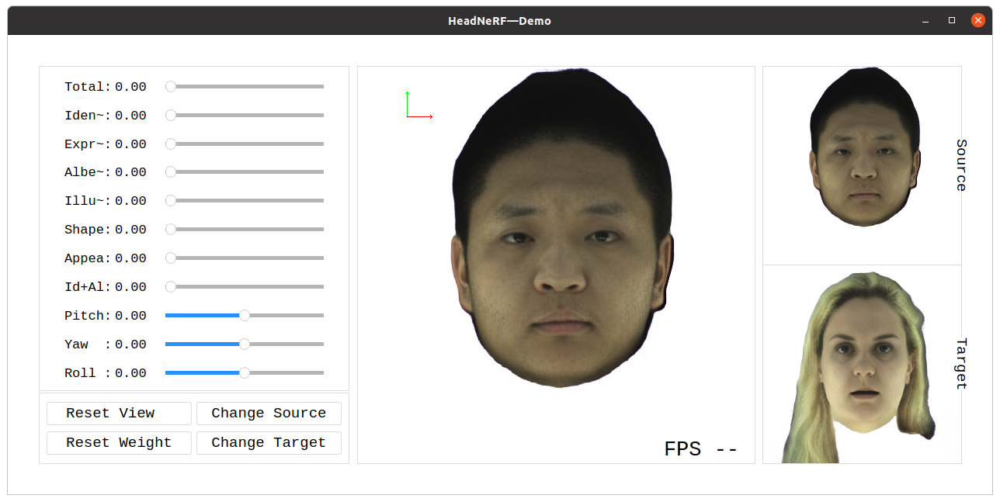

# HeadNeRF: A Real-time NeRF-based Parametric Head Model

<span id="code_demo"></span>

This repository contains a pytorch implementation of "HeadNeRF: A Real-time NeRF-based Parametric Head Model (CVPR 2022)".
Authors: [Yang Hong](https://crishy1995.github.io/), Bo Peng, Haiyao Xiao, [Ligang Liu](http://staff.ustc.edu.cn/~lgliu/) and [Juyong Zhang*](http://staff.ustc.edu.cn/~juyong/).


### | [Project Page](https://crishy1995.github.io/HeadNeRF-Project/) | [Paper](https://arxiv.org/abs/2112.05637) | 


This code has been tested on ubuntu 20.04/18.04 and contains the following parts:

1. **An interactive GUI** that allows users to utilize HeadNeRF to directly edit the generated images’ rendering pose and various semantic attributes.  
2. **A fitting framework** for obtaining the latent code embedding in HeadNeRF of a single image. 

## Requirements
- python3
- torch>=1.8.1
- torchvision
- imageio
- kornia
- numpy
- opencv-python==4.3.0.36
- pyqt5
- tqdm
- face-alignment
- Pillow, plotly, matplotlib, scipy, scikit-image
    We recommend running the following commands to create an anaconda environment called "headnerf" and automatically install the above requirements.
    ```bash
    conda env create -f environment.yaml
    conda activate headnerf
    ```

- [Pytorch](https://pytorch.org/get-started/locally/)
  
  Please refer to [pytorch](https://pytorch.org/get-started/locally/) for details. 


- [Pytorch3d](https://github.com/facebookresearch/pytorch3d)
    
    It is recommended to install pytorch3d from a local clone. 
    ```bash
    
    git clone https://github.com/facebookresearch/pytorch3d.git
    cd pytorch3d && pip install -e . && cd ..
    ```
<!-- 
    conda install -c bottler nvidiacub
    conda install -c fvcore -c iopath -c conda-forge fvcore iopath -->

Note: 
- In order to run the code smoothly, a GPU with performance higher than 1080Ti is recommended. 
- This code can also be run on Windows 10 when the mentioned above requirements are satisfied.
<!-- - For NVIDIA 30 series GPUs, installing the pytorch with the specified version may be necessary to avoid compatibility issues. Please refer to [pytorch](https://pytorch.org/get-started/locally/) for details. -->

<!-- ``` 
pip3 install torch==1.8.2+cu111 torchvision==0.9.2+cu111 -f https://download.pytorch.org/whl/lts/1.8/torch_lts.html 
``` -->
<!-- By testing, it is found that the following command is working for installing pytorch on NVIDIA 30 series GPUs.  -->

## Getting Started
Download [ConfigModels.zip](https://mailustceducn-my.sharepoint.com/:u:/g/personal/hymath_mail_ustc_edu_cn/EVROtiHQqNtLoAlLweyIFV0BDrLcGn_bpHnlM6tREfcQLQ?e=n0howy), [TrainedModels.zip](https://mailustceducn-my.sharepoint.com/:u:/g/personal/hymath_mail_ustc_edu_cn/EZ78EK8mylZBoGe-jCVibjEBVtoicnFvM0jpjaE56F4ihw?e=LC0SH7), and [LatentCodeSamples.zip](https://mailustceducn-my.sharepoint.com/:u:/g/personal/hymath_mail_ustc_edu_cn/EWNBh3ZVo7VFnO9uPRuDYAABbhrx8kyQa53fHv4szdgJ-A?e=bXiAfh), then unzip them to the root dir of this project.  

Other links: [Google Drive](https://drive.google.com/drive/folders/1e-DWDrCB6mUcr6MnGbMX0M9YTVl2U6KO?usp=sharing), [One Drive](https://mailustceducn-my.sharepoint.com/:f:/g/personal/hymath_mail_ustc_edu_cn/Eld8rudJhVVMrgkl-OLmKjQBBZRUg_q-1O_kWizcGYpTjQ?e=xyfLfw)

The folder structure is as follows:
```
headnerf
├── ConfigModels
│   ├── faceparsing_model.pth
│   ├── nl3dmm_dict.pkl
│   └── nl3dmm_net_dict.pth
│
├── TrainedModels
│   ├── model_Reso32.pth
│   ├── model_Reso32HR.pth
│   └── model_Reso64.pth
│
└── LatentCodeSamples
    ├── model_Reso32
    │   ├── S001_E01_I01_P02.pth
    │   └── ...
    ├── model_Reso32HR
    │   ├── S001_E01_I01_P02.pth
    │   └── ...
    └── model_Reso64
        ├── S001_E01_I01_P02.pth
        └── ...
```
Note:
- **faceparsing_model.pth** is from [face-parsing.PyTorch](https://github.com/zllrunning/face-parsing.PyTorch), and we utilize it to help generate the head mask.
- **nl3dmm_dict.pkl** and **nl3dmm_net_dict.pth** are from [3D face from X](https://arxiv.org/abs/1808.05323), and they are the parameters of 3DMM.
- **model_Reso32.pth**, **model_Reso32HR.pth** and **model_Reso64.pth** are our pre-trained models, and their properties are as follows:  

    |  Pre-trained Models   | Feature Map's Reso | Result's Reso | GPU 1080Ti |  GPU 3090 |
    |  ----  | :-:   |  :-:   | :-:   | :-:   |
    | model_Reso32  | 32 x 32 | 256 x 256 | \~14fps | \~40fps |
    | model_Reso32HR  | 32 x 32 | 512 x 512 | \~13fps | \~30fps |
    | model_Reso64  | 64 x 64 | 512 x 512 | \~ 3fps | \~10fps |

- **LatentCodeSamples.zip** contains some latent codes that correspond to some given images.


## The Interactive GUI

```bash
#GUI, for editing the generated images’ rendering pose and various semantic attributes.
python MainGUI.py --model_path "TrainedModels/model_Reso64.pth"
```
Args:
- **model_path** is the path of the specified pre-trained model.

An interactive interface like [the first figure](#code_demo) of this document will be generated after executing the above command. 

<!--  -->

<!--  -->

## The fitting framework

This part provides a framework for fitting a single image using HeadNeRF. Besides, some test images are provided in test_data/single_images dir. These images are from [FFHQ dataset](https://github.com/NVlabs/ffhq-dataset) and do not participate in building HeadNeRF's models. 

#### Data Preprocess
```bash
# generating head's mask.
python DataProcess/Gen_HeadMask.py --img_dir "test_data/single_images"

# generating 68-facial-landmarks by face-alignment, which is from 
# https://github.com/1adrianb/face-alignment
python DataProcess/Gen_Landmark.py --img_dir "test_data/single_images"

# generating the 3DMM parameters
python Fitting3DMM/FittingNL3DMM.py --img_size 512 \
                                    --intermediate_size 256  \
                                    --batch_size 9 \
                                    --img_dir "test_data/single_images"
```
The generated results will be saved to the --img_dir.

#### Fitting a Single Image

```Bash
# Fitting a single image using HeadNeRF
python FittingSingleImage.py --model_path "TrainedModels/model_Reso32HR.pth" \
                             --img "test_data/single_images/img_000037.png" \
                             --mask "test_data/single_images/img_000037_mask.png" \
                             --para_3dmm "test_data/single_images/img_000037_nl3dmm.pkl" \
                             --save_root "test_data/fitting_res" \
                             --target_embedding "LatentCodeSamples/*/S025_E14_I01_P02.pth"
``` 

Args:
- **para_3dmm** is the 3DMM parameter of the input image and is provided in advance to initialize the latent codes of the corresponding image.
- **target_embedding** is a head's latent code embedding in HeadNeRF and is an optional input. If it is provided, we will perform linear interpolation on the fitting latent code embedding and the target latent code embedding, and the corresponding head images are generated using HeadNeRF. 
- **save_root** is the directory where the following results are saved.

Results: 
- The image that merges the input image and the fitting result.
- The dynamic image generated by continuously changing the rendering pose of the fitting result.
- The dynamic image generated by performing linear interpolation on the fitting latent code embedding and the target latent code embedding.
- The latent codes (.pth file) of the fitting result.

Note:
- Fitting a single image based on **model_Reso32.pth** requires more than **~5 GB** GPU memory.
- Fitting a single image based on **model_Reso32HR.pth** requires more than **~6 GB** GPU memory.
- Fitting a single image based on **model_Reso64.pth** requires more than **~13 GB** GPU memory.

## Citation
If you find our work useful in your research, please consider citing our paper:
```
@article{hong2021headnerf,
     author     = {Yang Hong and Bo Peng and Haiyao Xiao and Ligang Liu and Juyong Zhang},
     title      = {HeadNeRF: A Real-time NeRF-based Parametric Head Model},
     booktitle  = {{IEEE/CVF} Conference on Computer Vision and Pattern Recognition (CVPR)},
     year       = {2022}
  }
```
If you have questions, please contact hymath@mail.ustc.edu.cn.

## Acknowledgments
- We use [face-alignment](https://github.com/1adrianb/face-alignment) for detecting 68-facial-landmarks. 
- We use [face-parsing.PyTorch](https://github.com/zllrunning/face-parsing.PyTorch) for generating the head mask. 
- The 3DMM that we use is from [3D face from X](https://arxiv.org/abs/1808.05323) and [Noliner3DMM](https://openaccess.thecvf.com/content_cvpr_2018/papers/Tran_Nonlinear_3D_Face_CVPR_2018_paper.pdf). 
- The code of fitting a single image using 3DMM is modified from [3DMM-Fitting-Pytorch](https://github.com/ascust/3DMM-Fitting-Pytorch).


## License
Academic or non-profit organization noncommercial research use only.


<!-- - This research was supported by the National Key R&D Program of China (2020YFC1523102), the National Natural Science Foundation of China (No.62122071, 62025207), the Youth Innovation Promotion Association CAS (No. 2018495) and the Fundamental Research Funds for the Central Universities (No.WK3470000021). -->